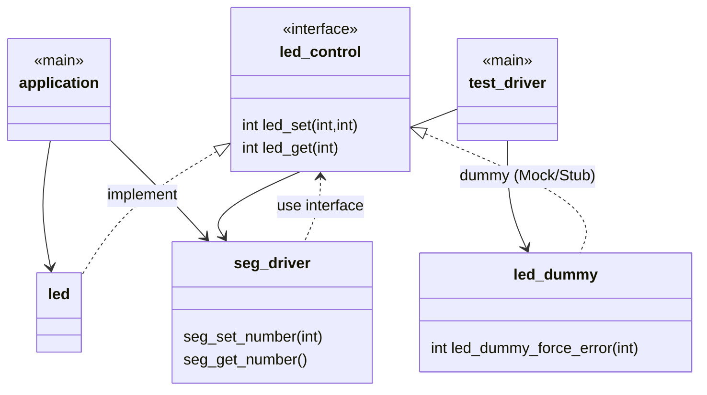

## Example simple lazy test

```mermaid
classDiagram
class led_control
    <<interface>> led_control
    led_control : int led_set(int,int)
    led_control : int led_get(int)
class led_dummy
    led_dummy : int led_dummy_force_error(int)
class seg_driver
    seg_driver : seg_set_number(int)
    seg_driver : seg_get_number()
class test_driver
    <<main>> test_driver
class application
    <<main>> application
led_control <|.. led : implement
led_control <|.. led_dummy : dummy (Mock/Stub)
led_control <.. seg_driver : use interface
test_driver --> seg_driver
test_driver --> led_dummy
application --> seg_driver
application --> led
```
