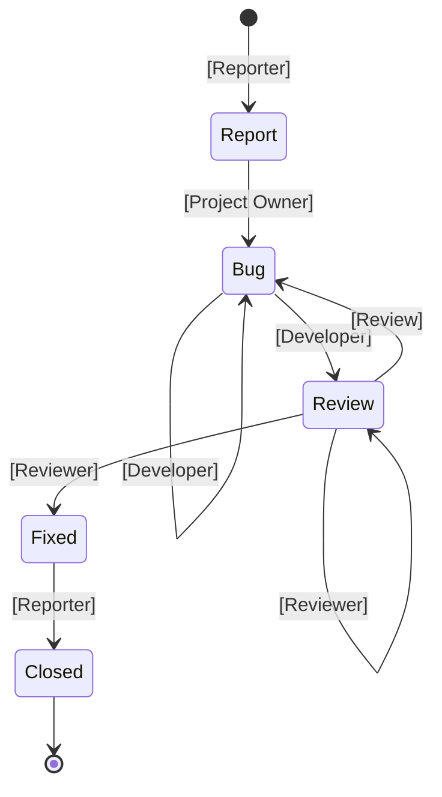

## Example simple lazy test

```mermaid
stateDiagram-v2
    [*] --> Report: [Reporter]
    Report --> Bug: [Project Owner]
    Bug --> Bug: [Developer]
    Bug --> Review: [Developer]
    Review --> Bug: [Review]
    Review --> Review: [Reviewer]
    Review --> Fixed: [Reviewer]
    Fixed --> Closed: [Reporter]
    Closed --> [*]
```
