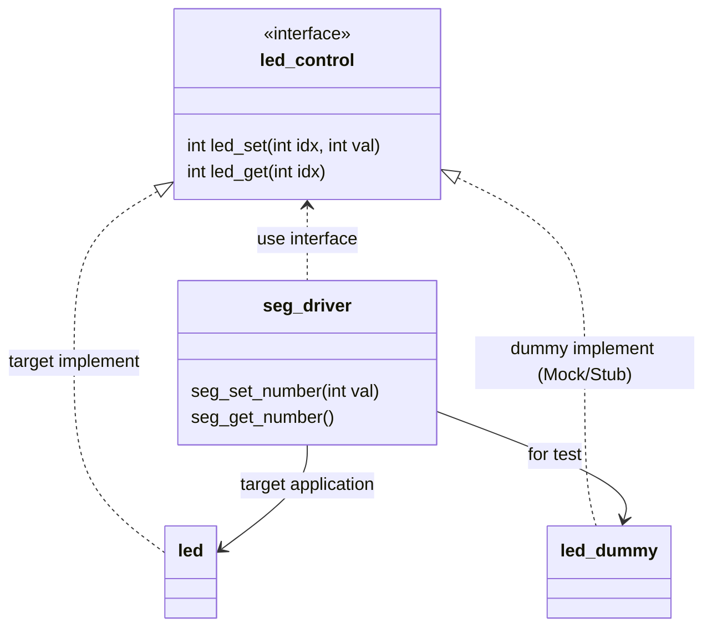

## Example simple lazy test

```mermaid
classDiagram
class led_control
    <<interface>> led_control
    led_control : int led_set(int idx, int val)
    led_control : int led_get(int idx)
class seg_driver
    seg_driver : seg_set_number(int val)
    seg_driver : seg_get_number()
led_control <|.. led : target implement
led_control <|.. led_dummy : dummy implement (Mock/Stub)
led_control <.. seg_driver : use interface
seg_driver --> led : target application
seg_driver --> led_dummy : for test
```
